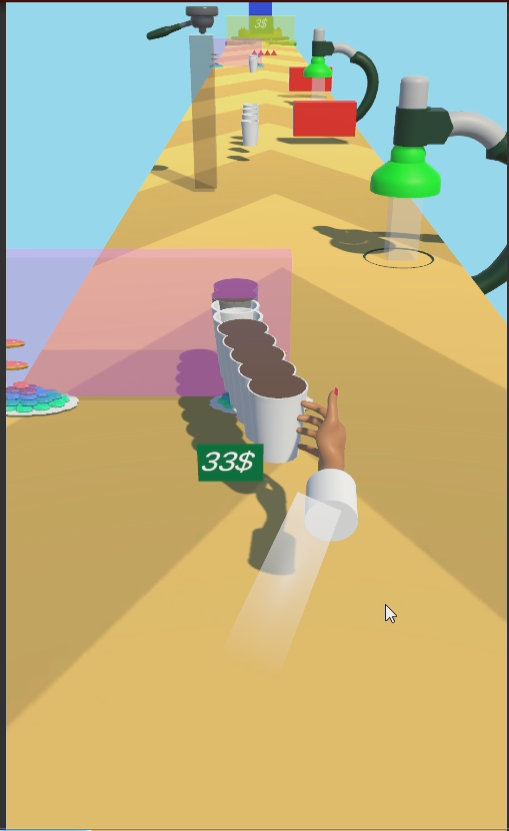
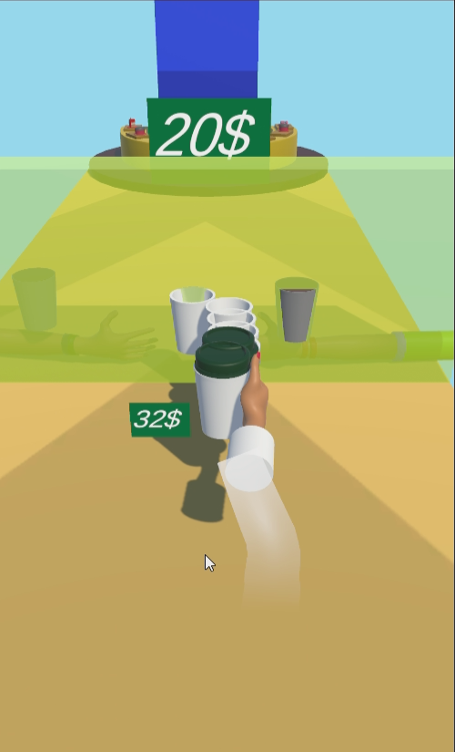
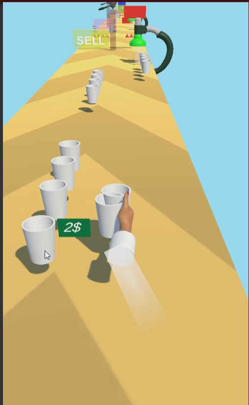

# CoffeStack-Clone
This is my first assigmnet for JuniorFactory incubation program.
This project is a Clone of Coffe stack game you can acces to the orginal game from teese links.

📱 Google Play: https://play.google.com/store/apps/details?id=markergame.coffeestack

🍎 App Store: https://apps.apple.com/us/app/coffee-stack/id1591921962

There is a 2 Sceenes in the project, FreeAsset Scenee is includes ONLY free assets and CloneAssets Sceene uses the clone assets that made for this porject.All the porject is made by me.

## Unity Version
- 2022.3.32f1

## Preview

  
  
  

  

[For More Gameplay](https://drive.google.com/drive/folders/1tkdSzvsS3fF0iadqg8Rk_dr0WfuVsdN7)
## Assets
CoffeShop Assets= [CoffeeShop Starter Pack](https://assetstore.unity.com/packages/3d/props/coffeeshop-starter-pack-160914).

Clone Assets =  Clone assetts made by [Ahmet Şenocak](https://www.linkedin.com/in/ahmetsenocak/) 

DoTwen = [DOTween (HOTween v2)](https://assetstore.unity.com/packages/tools/animation/dotween-hotween-v2-27676)

